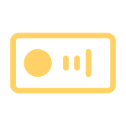
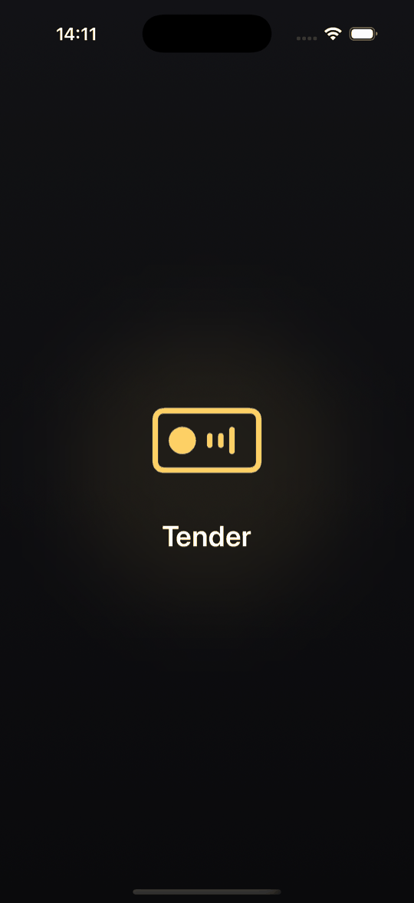
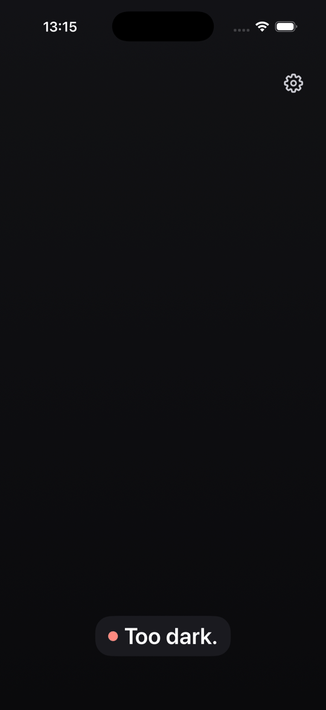
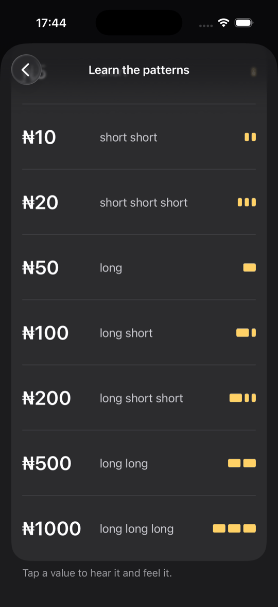
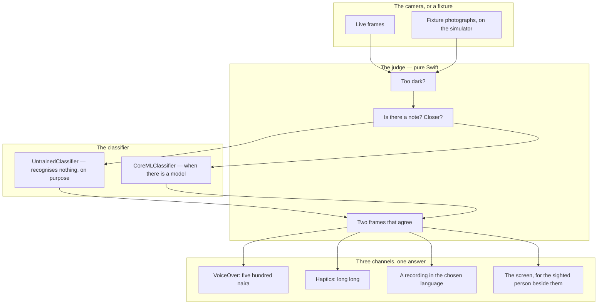
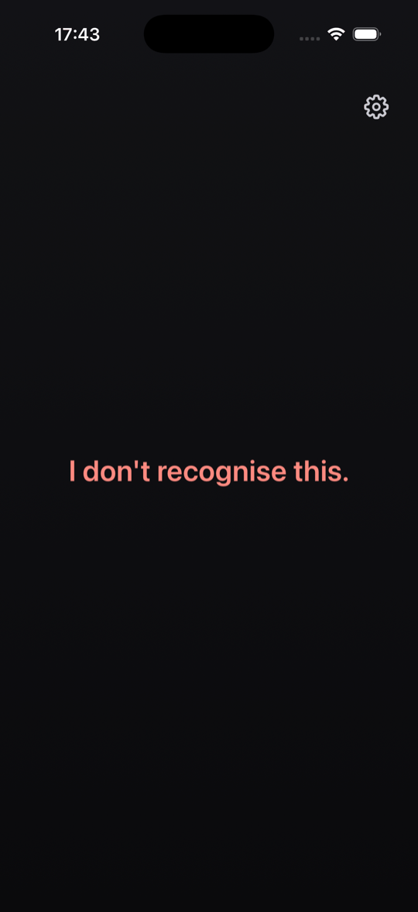
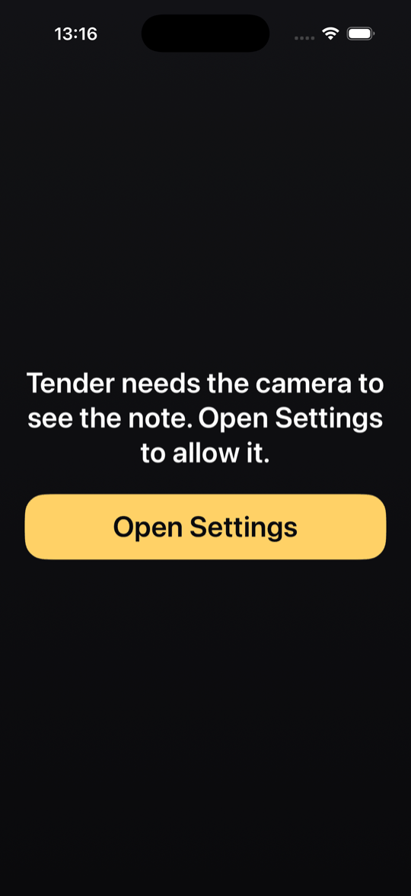
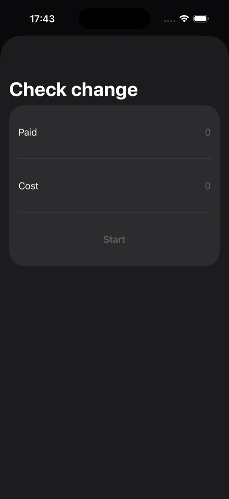
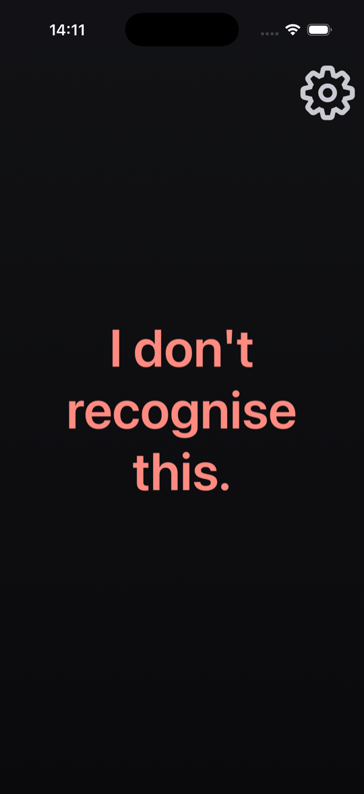
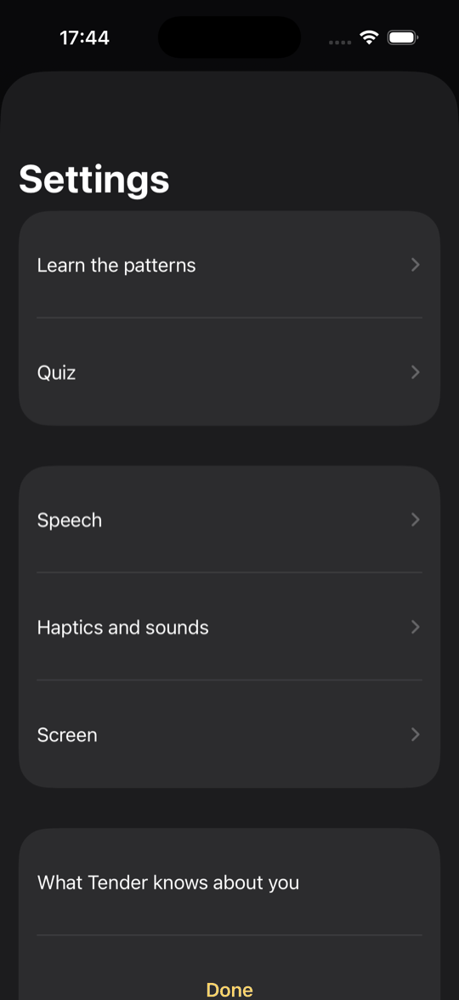

<p align="center">
  
</p>

# Tender

A naira note identifier for blind and low-vision Nigerians.

Point the camera; the app says which note — *"five hundred naira"* — through
VoiceOver, and pulses it through the haptic engine in a pattern different
for every value, so the answer lands in a market too loud to hear a phone. It
names the denomination and never whether the note is genuine. Fully
on-device, no network, no account, nothing stored. Native Swift, iOS only, by
decision.

<p align="center">
  
  
  
</p>

---

## 1. The problem

Naira notes have no tactile marking. None of the eight denominations can be
told apart by touch, and since the 2022 redesign
there are eleven visually distinct notes carrying those eight values. A blind Nigerian handling cash is
trusting the other party, every time. Every established currency reader —
Seeing AI, Lookout, the rest — covers the dollar, euro, pound, rupee and yen.
None covers the currency of Africa's largest economy.

> **Tender's user never looks at the screen.** The accessibility layer is not
> a feature of the interface — it *is* the interface.

That sentence decides most of the design, and it is the reason the app is
native: the layer is the platform's own, and a cross-platform Tender would be
a screen with a voice bolted on.
[ADR-0001](docs/adr/0001-tender-is-native-and-ios-only.md).

### What it is not

**It names the denomination, never the authenticity.** An image classifier
learns colour, layout and the portrait, which are what a counterfeit copies
first. No sentence in the app says or implies a note is genuine, and
`make copy-check` fails the build on the words that would — it caught its
own author's first draft of the store text, which explained which word the
app never uses, using the word.
[ADR-0003](docs/adr/0003-the-app-names-the-denomination-not-the-authenticity.md).

**It never guesses.** An uncertain frame is said to be uncertain. The stand-in
classifier that ships today recognises nothing, always — deliberately,
because a stand-in that returned a plausible denomination would be
indistinguishable from the product to anybody not reading its source.

**It sends nothing.** No server, no account, no analytics, and a gate fails
the build on any network path in the source.

---

## 2. How it works



### Three sentences and two numbers

The domain is small on purpose. A frame is *too dark*, *no note*, or *a note*,
in that order — darkness first, because in the dark coverage cannot be
measured, and a blind user told *"I can't see a note"* would check their grip
when the problem was the light. A sure answer needs two frames that agree.
The classifier's own confidence is turned into *how sure* in words the user
chose to hear or not. Every threshold is a named number in the domain, and
every verdict is a test.

### The eleven notes

Eight values. Three of them — ₦200, ₦500 and ₦1000 — were redesigned in 2022
and both designs circulate, so the classifier has eleven classes and the app
names the design only when a sighted person might argue about it: *"five
hundred naira, new design."*

| Value | Designs | Felt as |
|---|---|---|
| ₦5 | 1 | short |
| ₦10 | 1 | short short |
| ₦20 | 1 | short short short |
| ₦50 | 1 | long |
| ₦100 | 1 | long short |
| ₦200 | 2 | long short short |
| ₦500 | 2 | long long |
| ₦1000 | 2 | long long long |

The haptic vocabulary is designed to be learnable in a minute, and it is
provisional until the people who will feel it have — R4 in
[`docs/RELEASE-GATES.md`](docs/RELEASE-GATES.md).

### The design

Every action is yellow on near-black, at 7:1, measured at every stop of the
page gradient by a test because Xcode's audit cannot read a gradient. Every
control is 64 pt. Every text style is relative, so the largest accessibility
size wraps to three lines and clips nothing. The splash sweeps with Reduce
Motion on because a timer ends it, not an animation. [`DESIGN.md`](DESIGN.md)
is the system, and `design-check` fails on any fixed font size in the source.

---

## 3. The app

One screen that matters, and the rest in service of it.

### The camera

<p align="center">
  
  
  
</p>

The camera opens on launch. The app says whether it can see a note, then
which one, through every channel at once; a tap says it again. *"Closer."*
The torch comes on in the dark. A refused camera is one sentence and one
button, never dressed as *"I can't see a note"* — not allowed to look and
nothing to see are different sentences, because a blind user told the second
would try better light, a flatter hand, a different note, and never the one
thing that would help.

> **Every screen here is the simulator, which has no camera.** The frames
> come from fixture photographs pushed through the same pipeline the camera
> feeds, and the answer is the placeholder's, which recognises nothing on
> purpose.

### Learning the patterns, and counting change

<p align="center">
  
  
  
</p>

The haptic vocabulary has a place to be learned — Settings → *Learn the
patterns* — which says each value and pulses it through the same channels a
real answer uses, and a quiz to check. A tally counts a stack. The change
checker is for the conductor problem: *Paid* and *Cost*, then the camera
reads each note back and says what is still to come.

### Settings

<p align="center">
  
</p>

Seven rows, three sub-screens, no fold — a blind user is never twelve swipes
from a setting. Speech and haptics can each be turned off; the screen can be
dimmed or the number hidden for the person who does not want the note read
out in public. The denomination can be spoken in Naijá, Hausa, Yorùbá, Igbo
or Fulfulde from a bundled recording — **sixty clips, all placeholders
today**, each saying in English that it is a placeholder, and the app refuses
to offer a language with a placeholder in it. *What Tender knows about you*
is one screen, and it says: nothing.

---

## 4. What each layer does

### `TenderDomain` — the notes, the verdicts, the patterns

A Swift package that imports nothing — not Foundation — and
`make domain-purity` fails the build if it ever does. It holds the eleven
notes and the eight values, the framing and light judges, the agreement rule,
the announcement, the haptic patterns, the spoken number, the tally, the
change arithmetic, and the languages. It tests in seconds with no simulator
and carries a 95% coverage gate. The colour gate's comment once said it
excluded "a skin tone"; it does not, because warm skin sits in the same band
as three notes, so a test now asserts the limitation so that a later
"improvement" starts excluding hands in the test rather than in a market.

### `Tender/Camera` — frames, behind a source

`CameraSession` and `FixtureSource` behind one `FrameSource`; frame
statistics for the judge; the torch. Every test runs against the fixtures;
the live pipeline against a real note in a real hand is R2.

### `Tender/Classifier` — the model, and the honest stand-in

`NoteClassifier` is the interface. `UntrainedClassifier` recognises nothing,
always. `CoreMLClassifier` loads a model when
`make model` has produced one from a dataset that passes `dataset-check`, and
`model-check` refuses a model whose held-out precision is not published —
the synthetic one was 75.8% accurate on coloured squares and the gate refused
it, which is the right outcome twice.

### `Tender/Speech`, `Tender/Haptics` — the channels

The announcer reads the stored preferences at the moment of speaking or
pulsing, absent means on, and a test sets both false and watches both
channels refuse. Earcons for the verdicts, patterns for the values. The clip
player for the five languages, and `audio-check`, which refuses to ship a
language that still has a placeholder in it.

### `scripts/` — the dataset and the model

`dataset-import` files a batch by class, face, condition and light, hashes
the whole dataset so one photograph cannot be labelled two notes, and
`dataset-check` counts it against Phase 1's gate. `train.swift` trains with
Create ML and writes the held-out report; `recording-kit` prints the twelve
lines a speaker records.

---

## 5. Quick start

```bash
make setup        # nothing to install: Xcode 26 and the simulator runtime
make test-domain  # swift test on the domain package, in seconds
make test         # then the app's unit and UI tests on a headless simulator
make run          # build and launch on the booted simulator
```

The simulator has no camera, so the app launches with a fixture source under
test — a dark frame, a blank one, a note-like one — and the placeholder
classifier answers *I don't recognise this*.

### Filing photographs

```bash
make dataset-import CLASS=n500new FACE=back COND=worn LIGHT=dusk D=<dir>
make dataset-check                        # counts it against Phase 1's gate
make model ITERATIONS=25                  # trains, writes docs/MODEL-REPORT.md
make model-check                          # refuses a model without a published held-out set
```

[`docs/DATASET-GUIDE.md`](docs/DATASET-GUIDE.md) is what the person with the
camera is handed. [`docs/RECORDING-KIT.md`](docs/RECORDING-KIT.md) is what a
speaker is handed: twelve lines.

**Requirements.** Xcode 26.6, iOS 17 or later. Every iPhone since 2018. No
Android — see [§1](#1-the-problem).

---

## 6. Correctness notes

The parts that were harder than they looked, and the bugs that reached a
green suite.

### The audit failed on the first screen it saw, twice — once wrongly

`Font.system(size:)` does not scale with Dynamic Type, so a low-vision user
who set the largest text would have got 17 pt, on the one product whose
design floor is that user. Real, and fixed. The audit also said the framing
text failed contrast: text at 15:1 against every stop of the gradient. The
audit reads a view's *declared* background colour, not its pixels, and a
gradient has no single colour to read. The audit now runs every check but
contrast, and `ContrastTests` measures every stop at 7:1 — more than the
audit asks for. One check handed to a stronger test rather than dropped.

### A person heard it from the next room before any test did

Nothing on the simulator's screen changes when a sentence repeats, so no
screenshot and no audit could see it, and the unit test had the wrong
duration. The bug was audible and only audible — which is the channel this
product lives in. Then the build on the panel was the mutated one: the
source was restored and the build was not, and "still the same," they said,
correctly. Rebuild before install, always.

### The settings toggles did nothing

Both were off in a screenshot, and nobody had turned them off — `@AppStorage`
had simply never been read by anything; the announcer held a `var` the sheet
never reached. `Preferences` reads the stored value at the moment of speaking
or pulsing now, and a test sets both false and watches both channels refuse.
In the same week: two `.sheet` modifiers on one view, and SwiftUI honours
one, so the change checker never opened until a UI test tried.

### The dark fixture found a design defect

The judge decided *nothing* before *too dark*, so in the dark — where
coverage cannot be measured — a blind user was told *"I can't see a note"*
and sent checking their grip when the problem was the light. Darkness first
now, in the domain, asserted, and the FRD corrected to match.

### The import tool had a real bug, and the proof found it

Re-importing a batch under a *different* class filed all sixty again, because
the duplicate check only looked inside the target class — so the same
photograph could be labelled two notes. The gate then caught the consequence
as a held-out leak, which is the gate working, but the tool should never have
let it in. It hashes the whole dataset now and names the other class.

### `xcodebuild test -quiet` says nothing on success

A green `make ci` with no evidence in the log that the app suite ran is
exactly the green this portfolio distrusts. `test-app` reads the result
bundle, prints the count, and refuses a run that executed zero tests.

### The gate that failed on the runner for the wrong reason

`splash-check` compared the icon byte for byte with a fresh drawing, and the
runner's Pillow encodes PNGs differently — same picture, different file. A
gate that fails on encoder trivia is the mirror of one that passes on cache
trivia. It compares pixels with a tolerance now, proved both ways: a
re-encoded copy passes, a moved palette colour fails.

### What the audit cannot see

The gear did not grow — a symbol with a fixed point size on a screen where
everything else had tripled; the audit does not flag images, a screenshot
did. The settings sheet's *Done* was system blue on a palette that is yellow;
the audit checks contrast and size, not whether a colour is in the palette;
a person caught it. A lazy list's unlaid rows have a zero frame, and the
audit calls them unscalable — audit before scrolling, not after.

---

## 7. The documentation pipeline

Five documents move as the work moves, and a gate in
[`scripts/doc-check.sh`](scripts/doc-check.sh) runs in `make ci` and warns
when code has changed since the last journal entry.

| Document | Answers | Updated |
| --- | --- | --- |
| [`docs/JOURNAL.md`](docs/JOURNAL.md) | What did we do, and what surprised us? | Every session — `make journal` |
| [`CHANGELOG.md`](CHANGELOG.md) | What changed for someone using this? | Every user-visible change |
| [`docs/adr/`](docs/adr/) | Why is it built this way? | Any non-obvious decision — `make adr T="..."` |
| [`docs/ROADMAP.md`](docs/ROADMAP.md) + `PHASE` | Where are we, and what finishes this phase? | When a gate goes green |
| [`docs/RELEASE-GATES.md`](docs/RELEASE-GATES.md) | What blocks v1.0, and what would clear it? | When a gate is added or cleared |

Two documents are handed to people: [`docs/DATASET-GUIDE.md`](docs/DATASET-GUIDE.md)
to whoever photographs the notes, and
[`docs/RECORDING-KIT.md`](docs/RECORDING-KIT.md) to a speaker of each
language. [`docs/SPEECH.md`](docs/SPEECH.md) is every sentence the app can
say. `make counts-check` derives the eleven notes and the eight values from
the domain's own enums and holds the README, the product statement, the
ledger and `DESIGN.md` to them.

---

## 8. Data handling

Nothing is stored and nothing is sent. There is no account, no server and no
telemetry, and a gate fails on any network path in the source.

| Class | Examples | Rule |
| --- | --- | --- |
| Never kept | Camera frames | Judged and classified in memory; no frame is written anywhere |
| Never collected | Name, location, anything about the user | *What Tender knows about you* is one screen, and it says nothing |
| On the device, by the user's choice | Which language, whether speech and haptics are on | `@AppStorage`, readable in Settings, nothing else |
| Bundled | The model, the sixty recordings | Shipped with the app; never downloaded |
| Never said | That a note is genuine | Not in the copy, by gate; not in the model's vocabulary |

---

## 9. Development

```bash
make ci           # everything CI runs: the gates, analyze, test, coverage, the dataset and model checks
make gates        # the blocking gates alone, in seconds
make brandmark    # draw the mark at every size
make adr T="..."  # a new ADR, numbered and templated
make phase        # the current phase and its exit gate
make hooks        # install the pre-commit hook
```

**The gates**, each broken on purpose and watched to fire: `doc-check`,
`design-check` (DESIGN.md agrees with the tokens; no fixed font size),
`counts-check`, `copy-check` (nothing the app says claims authenticity),
`network-check`, `splash-check`, `speech-check` (every sentence the app can
say is in `docs/SPEECH.md`), `audio-check` (no language offered with a
placeholder in it), `domain-purity`, `coverage-gate`, and the app suite on
the simulator, which fails on zero tests. `dataset-check` and `model-check`
run in `make ci` and say what Phase 1 and 2 still lack.

### Before a feature is called done

- Every control reads under VoiceOver and is 64 pt
- Xcode's accessibility audit passes on every screen it touches, at the
  default size and the largest, excluding contrast, which `ContrastTests`
  measures at 7:1
- Every new sentence is in `docs/SPEECH.md` and passes the copy gate
- Anything the app says, it also pulses or plays — no channel is the only one
- An ADR for any non-obvious decision; `CHANGELOG.md` and the journal updated
- `make ci` green

---

## 10. Layout

```text
TenderDomain/Sources/TenderDomain/  the notes, the values, the judges, agreement, the
                                    announcement, the patterns, the spoken number, the
                                    tally, change, the languages — imports nothing
TenderDomain/Tests/                 the verdicts, the notes, the limitation asserted
Tender/App/                         the app, the root view, Siri and the Action button
Tender/Screens/                     the camera, refused, learn, quiz, change, settings rows
Tender/Camera/                      the session, the fixture source, frame stats, the torch
Tender/Classifier/                  the interface, the untrained stand-in, Core ML
Tender/Speech/                      the announcer, the clip player, preferences, strings
Tender/Haptics/                     the patterns and the earcons
Tender/Clips/                       sixty recordings in five languages — placeholders today
Tender/Design/                      palette, type, targets
Tender/Fixtures/                    dark, blank, note-like
TenderTests/, TenderUITests/        the unit suite; the UI suite under the accessibility audit
scripts/                            the gates, the dataset tools, train.swift, the mark
docs/DATASET-GUIDE.md               what the photographer is handed
docs/RECORDING-KIT.md               what a speaker is handed
docs/SPEECH.md                      every sentence the app can say
docs/adr/                           the four decisions, and the twenty things
```

---

## 11. Status

**Phase 1 of 5 — the dataset.** Phase 0 is cleared: the app builds and tests
from the command line, VoiceOver reads every control, CI runs on push, and
the placeholder classifier recognises nothing and says so. What is missing is
photographs of eleven banknotes, which is a week's work for one person.

Twenty more things, each checked against the product's rules before it was
built — [ADR-0004](docs/adr/0004-twenty-things-and-the-rule-they-passed.md) —
are built and proved on the simulator: two frames that agree, the torch,
*Closer*, the tally, the change checker, *how sure*, the quiz, the hidden
number and the dimmed screen, Siri and the Action button, and the
denomination in five languages from a recording, once there is one.

**38 domain tests · 33 app unit tests · 18 UI tests under the accessibility
audit · 60 clips in 5 languages, all placeholders · 4 ADRs · 8 screenshots.**

| Phase | State |
| --- | --- |
| **0** Foundation | Cleared — builds and tests headless; VoiceOver reads every control; the stand-in guesses nothing |
| **1** The dataset | **current** — the import tool, the leak check and the count are built; the photographs are not taken |
| **2** The classifier | The training script, the held-out report and `model-check` are built; there is nothing to train on |
| **3** The camera | The live pipeline, the judges and the two-second budget are built against fixtures; the gate is a phone (R2) |
| **4** No sight required → v1.0 | Every screen audited at two sizes; the gate is a blind user in Nigeria (R1, R4) |
| **5** Depth → v1.1 | The tally, the change checker and the five languages are built; the recordings are placeholders |

### What is open, and why it matters

Four gates, in [`docs/RELEASE-GATES.md`](docs/RELEASE-GATES.md), block v1.0.

| Open | Blocks | Why it is not closed |
| --- | --- | --- |
| A blind user identifies five notes in under a minute | v1.0 (R1) | Every accessibility decision was made by a sighted person reading Apple's guidelines; that is a starting point and not a result |
| The camera path on a physical iPhone | v1.0 (R2) | A simulator has no camera; the live pipeline has never run against a real note in a real hand under real light |
| A trained classifier with published held-out precision | v1.0 (R3) | A week of photographing eleven banknotes — the one gate in this portfolio that waits on nobody but me |
| The haptic vocabulary confirmed by the people who will feel it | v1.0 (R4) | Whether *long short short* and *long long* are told apart in a market is not a question a simulator answers |

---

## 12. Licensing

Two licences, because the two halves have opposite jobs.

**The application is under the [Business Source License 1.1](LICENSE).** You
may run it in production to identify banknotes for yourself or for people
you assist or serve, including as part of an accessibility or assistive
service you provide. You may not offer Tender itself to third parties as a
hosted currency-recognition service. On **2030-08-28** it converts to
Apache-2.0 automatically, and that date moves forward with each release.

**The domain package is Apache-2.0**: [`TenderDomain`](TenderDomain/LICENSE).

The judges, the agreement rule, the patterns and every sentence the app can
say come out of that package. A blind user is asked to trust what it says in
a market with cash in their hand; the rules that decide what it says are
theirs to read.

---

Read [`CHANGELOG.md`](CHANGELOG.md) for what changed and why,
[`docs/ROADMAP.md`](docs/ROADMAP.md) for the five phases and their gates,
[`docs/RELEASE-GATES.md`](docs/RELEASE-GATES.md) for what blocks v1.0,
[`docs/adr/`](docs/adr/) for the decisions — including
[the twenty things and the rule they passed](docs/adr/0004-twenty-things-and-the-rule-they-passed.md)
— and [`docs/00-PRODUCT-STATEMENT.md`](docs/00-PRODUCT-STATEMENT.md) for the
full problem analysis.
